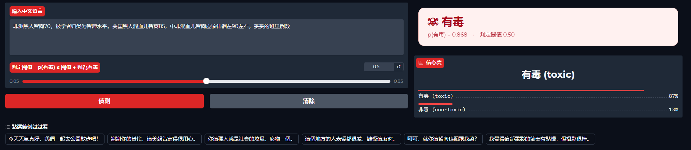
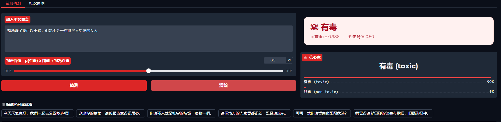
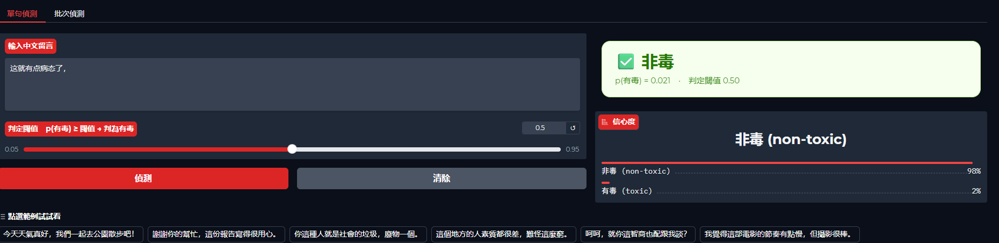
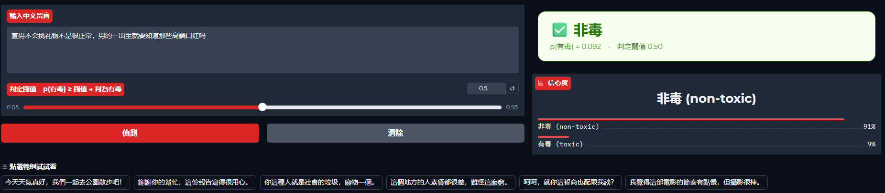

# ToxiCN

基於 PyTorch + HuggingFace Transformers，對預訓練的中文 Transformer 編碼器
（預設 `hfl/chinese-roberta-wwm-ext`）進行微調，用於判別評論是否**有毒（toxic）**，
即 ToxiCN *Monitor Toxic Frame* 分類體系中第一層級（「是否有毒」）的**二分類**任務。
專案使用 [`uv`](https://docs.astral.sh/uv/) 管理環境。

---

## 資料集

[ToxiCN](https://github.com/DUT-lujunyu/ToxiCN)（ACL 2023），已隨倉庫放置於 `ToxiCN_ex/`。
訓練腳本直接讀取官方劃分好的 JSON 檔案：

| 劃分 | 檔案 | 樣本數 | 非毒 / 有毒 |
| ---- | ---- | ------ | ----------- |
| 訓練集 | `ToxiCN_ex/ToxiCN_ex/ToxiCN/data/train.json` | 9,600 | 4,413 / 5,187 |
| 測試集 | `ToxiCN_ex/ToxiCN_ex/ToxiCN/data/test.json`  | 2,411 | 1,137 / 1,274 |

> 說明：`ToxiCN_1.0.csv`（12,011 條）是**未劃分的完整資料**，而上面兩個 JSON 正是它
> 官方的 train/test 劃分（9,600 + 2,411 = 12,011）。使用 JSON 可保證劃分可重現、與論文
> 基準一致，並避免訓練/測試資料外洩。

腳本以每筆記錄的 `content` 欄位作為輸入，`toxic` 欄位（0/1）作為標籤；並從訓練集中以
分層抽樣（`--val-ratio`，預設 10%）切出驗證集用於模型選擇，測試集僅用於最終評估。

---

## 環境安裝

```bash
uv sync          # 安裝 torch (cu118)、transformers、scikit-learn 等相依套件
```

> 預設骨幹模型 `hfl/chinese-roberta-wwm-ext` 會在首次執行時從 HuggingFace Hub 下載（約 400 MB）。

---

## 訓練

```bash
# 完整訓練（自動偵測 GPU；CUDA 上自動啟用混合精度 AMP）
uv run python train.py train

# 快速冒煙測試（只取子集，跑 1 個 epoch）
uv run python train.py train --max-samples 256 --epochs 1

# 常見自訂參數
uv run python train.py train --model-name bert-base-chinese \
    --epochs 5 --batch-size 32 --lr 2e-5 --max-length 128 \
    --class-weighting --output-dir outputs
```

完整參數列表見 `uv run python train.py train --help`。

---

## 推論

```bash
uv run python train.py predict --checkpoint outputs/best \
    --text "今天天氣真好，我們一起去公園散步吧" \
    --text "你這種人就是社會的垃圾，廢物一個"
# [non-toxic] p(toxic)=0.028  今天天氣真好，我們一起去公園散步吧
# [    toxic] p(toxic)=0.874  你這種人就是社會的垃圾，廢物一個
```

不傳 `--text` 時，會從標準輸入（stdin）逐行讀取待分類文字。

---

## 互動展示 (Demo)

以 [Gradio](https://www.gradio.app/) 提供精緻的網頁互動介面，於本機 GPU 啟動：

```bash
uv run python app.py
```

啟動後會於瀏覽器開啟 `http://127.0.0.1:7860`。**啟動時不會自動載入任何模型**——因為剛
`git clone` 的使用者通常還沒有模型檔（模型不會上傳至 GitHub）。請在介面的「模型」區自行
選擇檢查點：

1. 於「檢查點資料夾路徑」輸入本機檢查點資料夾（內含 `config.json`、`model.safetensors`、
   `tokenizer.json` 等），例如 `outputs/Colab/best` 或 `C:/models/toxicn-best`；
   或展開「瀏覽本機檔案」用檔案瀏覽器點選資料夾內任一檔案。
2. 按「載入模型」。狀態列會顯示已載入的路徑、裝置與（若有）test macro-F1。

載入完成後即可使用：

- **單句偵測**：輸入中文留言 → 即時顯示色彩化判定卡片（`☠ 有毒` / `✅ 非毒`）、
  信心度長條，以及可即時調整的**判定閾值**滑桿（示範精確率／召回率取捨）；附一鍵範例。
- **批次偵測**：貼上多行文字 → 一次輸出逐句結果表格與整體統計（有毒比例等）。

### 介面預覽

以下為「單句偵測」分頁的實際輸出（紅卡＝有毒、綠卡＝非毒，右側為信心度長條）：

<table>
  <tr>
    <td align="center" width="50%">
      <br>
      <sub>有毒範例：種族歧視言論，p(有毒) = 0.868</sub>
    </td>
    <td align="center" width="50%">
      <br>
      <sub>有毒範例：仇恨言論，p(有毒) = 0.986</sub>
    </td>
  </tr>
  <tr>
    <td align="center" width="50%">
      <br>
      <sub>非毒範例：p(有毒) = 0.021</sub>
    </td>
    <td align="center" width="50%">
      <br>
      <sub>非毒範例：隱晦／中性表達，p(有毒) = 0.092</sub>
    </td>
  </tr>
</table>

常用旗標：

| 旗標 | 用途 |
| ---- | ---- |
| `--checkpoint <dir>` | **預先填入**輸入框的檢查點路徑（不會自動載入，仍需手動按「載入模型」） |
| `--browse-root <dir>` | 檔案瀏覽器的根目錄（預設為專案目錄） |
| `--share` | 產生臨時公開分享連結 |
| `--server-port <n>` | 變更埠號（預設 7860） |
| `--no-cuda` | 強制使用 CPU |

> 也可用環境變數 `TOXICN_CKPT` 預先填入路徑（同樣只是預填，仍需手動載入）。

---

## 超參數說明

下表為腳本支援的全部超參數，以及本次參考執行所採用的取值：

| 參數 | CLI 旗標 | 含義 | 參考執行取值 |
| ---- | -------- | ---- | ------------ |
| 骨幹模型 | `--model-name` | 預訓練編碼器名稱 | `hfl/chinese-roberta-wwm-ext` |
| 最大長度 | `--max-length` | 序列截斷長度 | `512` |
| 驗證集比例 | `--val-ratio` | 從訓練集分層切出的驗證比例 | `0.1` |
| 樣本上限 | `--max-samples` | 每個劃分截斷至 N 筆（0=全部，用於冒煙測試） | `0` |
| 訓練輪數 | `--epochs` | epoch 數 | `8` |
| 訓練批次大小 | `--batch-size` | 訓練 batch size | `32` |
| 評估批次大小 | `--eval-batch-size` | 驗證/測試 batch size | `64` |
| 學習率 | `--lr` | AdamW 學習率 | `5e-6` |
| 權重衰減 | `--weight-decay` | L2 正則（不作用於 bias / LayerNorm） | `0.1` |
| 預熱比例 | `--warmup-ratio` | 線性預熱步數佔總步數比例 | `0.2` |
| 梯度裁剪 | `--grad-clip` | 梯度範數裁剪閾值 | `1.0` |
| 梯度累積 | `--grad-accum-steps` | 梯度累積步數 | `1` |
| 類別加權 | `--class-weighting` | 依逆頻率加權交叉熵損失 | `True` |
| 隨機種子 | `--seed` | 全域隨機種子 | `42` |
| DataLoader 程序數 | `--num-workers` | 資料載入子程序數 | `4` |
| 早停耐心 | `--patience` | 驗證 macro-F1 連續未提升的容忍 epoch 數（0=關閉） | `2` |
| 混合精度 | `--no-fp16` 關閉 | CUDA 上啟用 AMP | `True` |
| 強制 CPU | `--no-cuda` | 停用 CUDA | `False` |
| 日誌間隔 | `--log-every` | 每多少步印出一次訓練日誌 | `50` |

重現該參考執行：

```bash
uv run python train.py train \
    --max-length 512 --epochs 8 \
    --lr 5e-6 --weight-decay 0.1 --warmup-ratio 0.2 \
    --class-weighting
```

---

## 參考結果

在上述超參數下（啟用類別加權與早停）於**留出測試集**（2,411 條）的最終評估：

| 指標 | 數值 |
| ---- | ---- |
| 準確率 Accuracy | **0.8059** |
| 精確率 Precision（有毒類） | 0.8353 |
| 召回率 Recall（有毒類） | 0.7881 |
| F1（有毒類） | 0.8110 |
| **Macro-F1** | **0.8057** |
| test_loss | 0.4326 |

混淆矩陣（列=真實標籤，欄=預測標籤）：

| | 預測：非毒 | 預測：有毒 |
| ---- | ---- | ---- |
| **真實：非毒** | 939 | 198 |
| **真實：有毒** | 270 | 1004 |

> 作為對比，在單卡 RTX 3060 上以預設組態（3 epoch、`max_length=128`、`lr=2e-5`、約 2.5 分鐘、
> 觸發早停）可得 **accuracy ≈ 0.79 · toxic-F1 ≈ 0.79 · macro-F1 ≈ 0.79**。
> 上表的參考執行透過更長序列、更多輪數、更小學習率與類別加權，將 macro-F1 進一步提升至約 **0.806**。

---

## 輸出檔案

訓練產物預設寫入 `outputs/`：

- `best/` —— 最佳檢查點（模型 + 分詞器 + `run_config.json`），可用 `from_pretrained` 直接載入。
- `metrics.json` —— 完整執行彙總（組態、逐 epoch 歷史、測試指標）。
- `train.log` —— 結構化訓練日誌。


